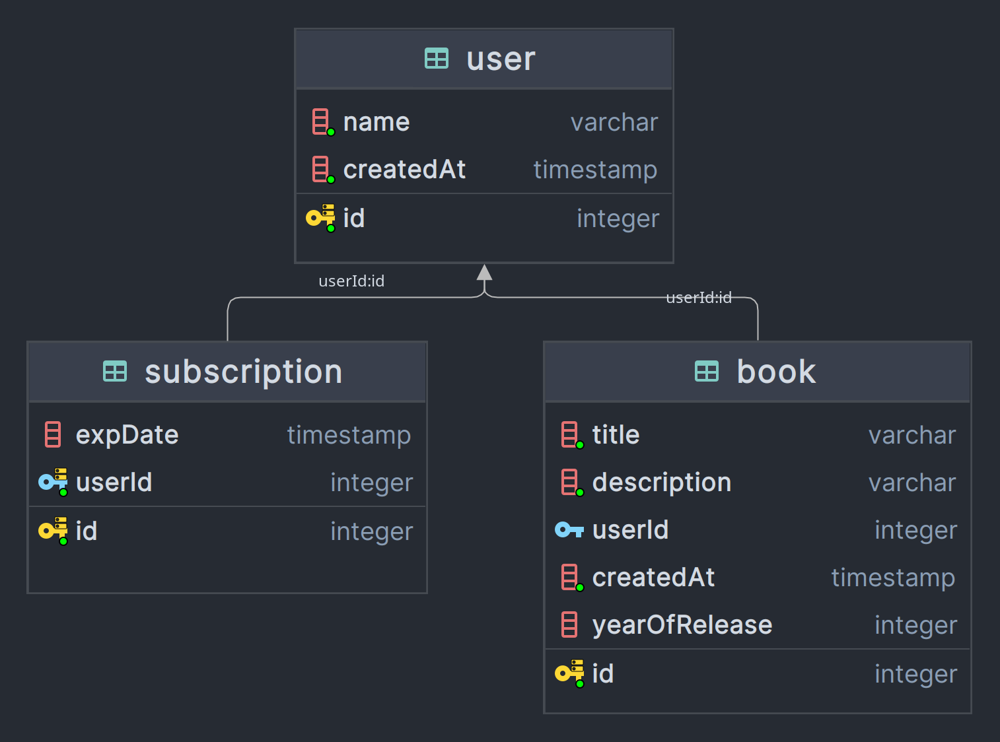
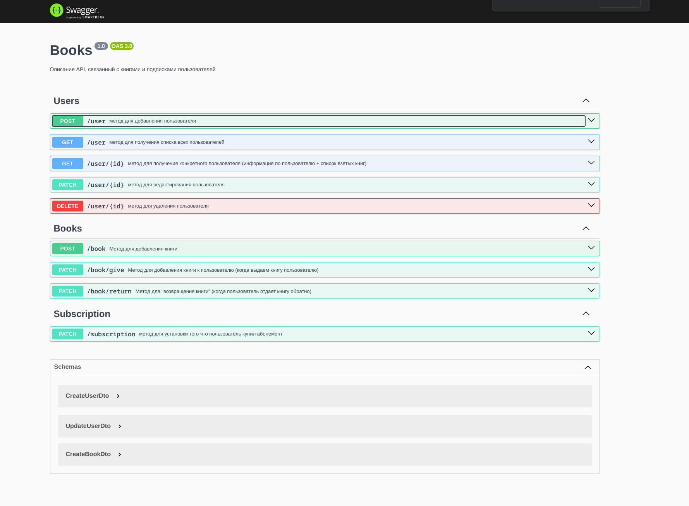

## Installation

```bash
$ npm install
```

## Running the app

```bash
# development
$ npm run start

# watch mode
$ npm run start:dev

# production mode
$ npm run start:prod
```

# Books

## Словарь предметной области

- **Пользователь** - человек, который может использовать веб-приложение.
- **Книга** - сущность, содержащая поля названия, описания и даты издания книги. Не может быть более 5 штук в руках одного пользователя.
- **Подписка, абонемент** - некий ‘пропуск’ для пользователя, позволяющий взять книги из библиотеки. Обновляется в единицах месяца с текущего дня.

## Функциональные требования

- Метод для добавления пользователя
- Метод для редактирования пользователя
- Метод для удаления пользователя
- Метод для установки того что пользователь купил абонемент. Не может быть более одного активного абонемента.
- Метод для получения списка всех пользователей
- Метод для получения конкретного пользователя (информация по пользователю + список взятых книг)
- Метод для добавления книги. У пользователя не может быть более 5 книг в одно время.
- Метод для добавления книги к пользователю (когда выдаем книгу пользователю). Пользователь не может брать книгу без абонемента и не может получить книгу, когда она в руках у другого пользователя.
- Метод для "возвращения книги" (когда пользователь отдает книгу обратно)

## Нефункциональные требования

- TypeScript
- Nest.js
- PostgreSQL
- TypeOrm

## Схема базы данных



## Документация

В качестве описания программного интерфейса был выбран инструмент,
поддерживающий стандарт OAS 3.0 – Swagger. Далее представлена
полученная документация API полученная автоматически по директивам,
указанным в декораторах различных методов и структурах данных внутри
разрабатываемой информационной системы.

[http://localhost:3000/api/](http://localhost:3000/api/)



Также, в описании методов приложены примеры и описание передаваемых параметров.